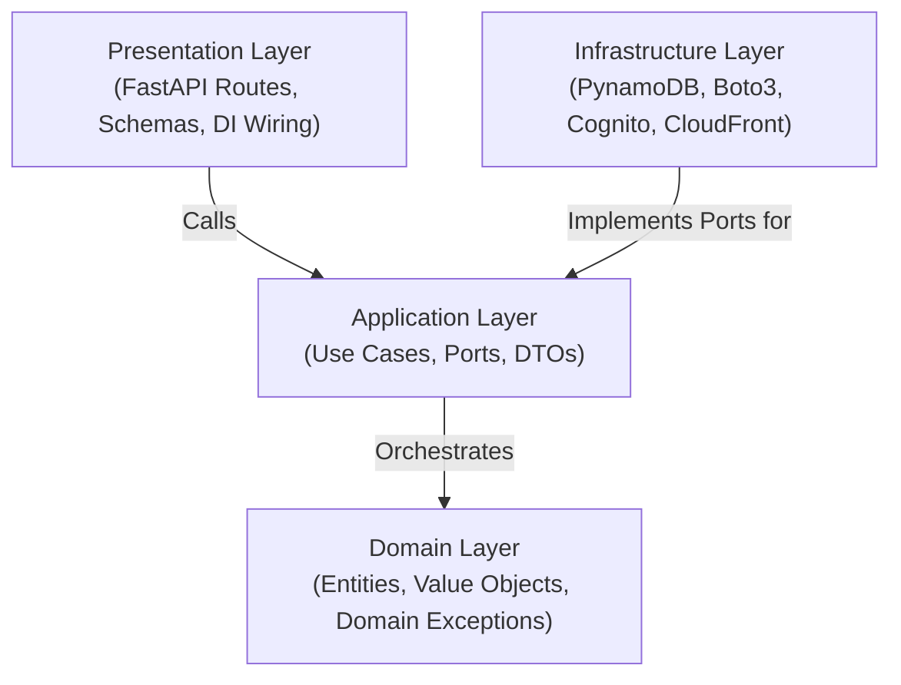

# DurianPy Badge System Backend

## Table of Contents
1. [Project Description](#1-project-description)
2. [Prerequisites](#2-prerequisites)
3. [Architecture Overview](#3-architecture-overview)
4. [Project Directory Structure](#4-project-directory-structure)
5. [Development Environment Setup (Dev Container)](#5-development-environment-setup-dev-container)
6. [AWS Authentication (AWS SSO)](#6-aws-authentication-aws-sso)
7. [Developer Workflows](#7-developer-workflows)
8. [Authentication & Authorization (AWS Cognito)](#8-authentication--authorization-aws-cognito)
9. [Coding Conventions & Standards](#9-coding-conventions--standards)
10. [Testing & Code Coverage](#10-testing--code-coverage)
11. [Deployment & Runtime](#11-deployment--runtime)
    - [11.1 Deploying to Dev for Cloud Testing](#111-deploying-to-dev-for-cloud-testing)


## 1. Project Description

Durianpy Project - TBA


## 2. Prerequisites

To develop in this project, you need:

- **Docker Desktop** or **Docker Engine**: Required to run the containerized development environment.
- **Visual Studio Code** with the **Dev Containers** extension (or any IDE supporting the Development Container specification).
- **AWS CLI**: Installed on the host workstation to handle AWS IAM Identity Center (AWS SSO) authentication.


## 3. Architecture Overview

This project is built following Clean Architecture principles (Ports and Adapters). The system enforces a strict inward dependency rule where core business logic remains independent of frameworks, databases, and external cloud infrastructure.



### Layer Responsibilities

- **Domain Layer (`src/domain/`)**: Contains pure enterprise domain entities, value objects, and domain exception hierarchies. Has zero external dependencies.
- **Application Layer (`src/application/`)**: Defines use case interactors, use case input/output ports (`UseCasePort`), security/token verifier ports, data transfer objects (DTOs), and repository/storage port contracts.
- **Infrastructure Layer (`src/infrastructure/`)**: Implements outbound ports using concrete AWS services (PynamoDB for Amazon DynamoDB, PyJWT/Boto3 for AWS Cognito token verification, and Amazon CloudFront for media URL resolution).
- **Presentation Layer (`src/presentation/`)**: Provides HTTP entry points via FastAPI routers, request/response Pydantic schemas, dependency injection providers (including auth and RBAC), and global exception handlers.


## 4. Project Directory Structure

```
.
├── .devcontainer/                  # Dev Container definitions and IDE configuration
│   └── devcontainer.json           # VS Code / Dev Container specification
├── docker/                         # Dockerfiles for local container environment
│   └── local/
│       └── Dockerfile              # Python 3.12 base image with uv and tools
├── scripts/                        # Development utilities and manual verification tools
│   └── test_auth_di.py             # Cognito token dependency injection test script
├── src/                            # Application source code
│   ├── application/                # Application layer
│   │   ├── dtos/                   # Data Transfer Objects
│   │   ├── ports/                  # Inbound and outbound abstract ports
│   │   │   ├── repositories/       # Database repository port interfaces
│   │   │   ├── security/           # Token verification and security port contracts
│   │   │   ├── storage/            # Object storage and CDN resolver ports
│   │   │   └── use_cases/          # Use case port contracts
│   │   └── use_cases/              # Use case interactor implementations
│   ├── core/                       # Cross-cutting concerns
│   │   ├── audit.py                # Audit attribution utilities
│   │   ├── logging.py              # Singleton Logger and sensitive data masking
│   │   └── settings.py             # Application settings configuration
│   ├── domain/                     # Domain layer
│   │   ├── exceptions/             # Domain exception hierarchy (auth, badge design)
│   │   └── models/                 # Domain entities and value objects (AuthenticatedUser, BadgeDesign)
│   ├── infrastructure/             # Infrastructure layer
│   │   ├── db/                     # DynamoDB models and PynamoDB repositories
│   │   │   ├── models/             # PynamoDB database table models
│   │   │   └── pynamo_repositories/# Concrete repository port implementations
│   │   ├── security/               # AWS Cognito JWT token verifier adapter
│   │   └── storage/                # Concrete storage and CDN resolver adapters
│   └── presentation/               # Presentation layer
│       └── api/                    # FastAPI web presentation
│           ├── dependencies/       # Dependency Injection providers (auth, repositories, use cases)
│           ├── routes/             # API route controllers
│           ├── schemas/            # Request and response Pydantic schemas
│           ├── exception_handlers.py# Global domain exception handlers (401, 403, 404, 422, 500)
│           ├── main.py             # ASGI application entrypoint
│           └── mangum_handler.py   # AWS Lambda Mangum handler
├── tests/                          # Automated test suite
│   └── unit/                       # Unit tests partitioned by layer
│       ├── application/            # Use case and DTO tests
│       ├── core/                   # Settings, logging, and audit tests
│       ├── domain/                 # Domain model and exception tests
│       ├── infrastructure/         # DynamoDB repository, Cognito verifier, and storage tests
│       └── presentation/           # Controller, auth DI, and exception handler tests
├── Justfile                        # Task runner command definitions
├── pyproject.toml                  # Project metadata, dependencies, and tool configs
└── uv.lock                         # Pinned dependency lockfile
```


## 5. Development Environment Setup (Dev Container)

Development for this project is standardized through **Dev Containers** to ensure consistent environments across all workstations.

### 5.1 Open in Dev Container

1. Open the project folder in Visual Studio Code.
2. When prompted by the Dev Containers extension, select **Reopen in Container** (or open the Command Palette with `Ctrl+Shift+P` / `Cmd+Shift+P` and choose `Dev Containers: Reopen in Container`).
3. The container will build using `docker/local/Dockerfile` and automatically execute `uv sync --frozen` and `just prepare-pre-commit` during initialization.
4. Host configuration directories (`~/.aws`, `~/.ssh`, `~/.gitconfig`) are automatically mounted into the container.

> [!IMPORTANT]
> **First and Foremost**: Before writing code or making commits, always ensure the git hooks are installed and initialized:
> ```bash
> just prepare-pre-commit
> ```
> This configures `pre-commit` (running `ruff` linting and formatting) and `commit-msg` (enforcing Conventional Commits) via `prek`.


## 6. AWS Authentication (AWS SSO)

Authenticate against AWS IAM Identity Center (AWS SSO) on your host machine or within the Dev Container.

- **SSO Start URL**: `https://durianpy-root.awsapps.com/start/#`
- **Default Region**: `ap-southeast-1` (automatically configured as default in `Justfile` and Terraform)

### 6.1 Configure AWS SSO Profile (One-time Setup)

```bash
aws configure sso
```
- **SSO session name**: `durianpy`
- **SSO start URL**: `https://durianpy-root.awsapps.com/start/#`
- **SSO region**: `ap-southeast-1`
- **SSO registration scopes**: `sso:account:access`
- **CLI default client Region**: `ap-southeast-1`
- **CLI default output format**: `json`
- **CLI profile name**: `durianpy-dev`

### 6.2 Authenticate & Sync Environment

```bash
# Authenticate AWS SSO session
aws sso login --profile durianpy-dev
export AWS_PROFILE=durianpy-dev

# Populate or refresh local .env from AWS SSM Parameter Store
just generate-env dev
```

Application settings are managed through `pydantic-settings` and loaded directly from environment variables and the local `.env` file generated by `just generate-env`.


## 7. Developer Workflows

A `Justfile` is provided inside the Dev Container to streamline development tasks:

### 7.1 First and Foremost: Install Pre-commit Hooks (Mandatory)

> [!IMPORTANT]
> **Run this command first before contributing code or making commits!**
>
> ```bash
> just prepare-pre-commit
> ```
>
> This initializes and installs the `pre-commit` and `commit-msg` git hooks using `prek`. These hooks automatically validate code formatting (`ruff format`), check lint rules (`ruff check`), and enforce [Conventional Commits](#86-conventional-commits) prior to every git commit.

### 7.2 Run Local Development Server

Starts FastAPI with hot-reloading:

```bash
just run-local-api
```

The API will be accessible at `http://127.0.0.1:8000`. Interactive OpenAPI documentation is available at `http://127.0.0.1:8000/docs`. Port 8000 is forwarded from the Dev Container to the host.

### 7.3 Run Unit Tests

Execute the automated test suite with coverage enforcement ($\ge$ 95%):

```bash
just run-unit-test
```

Running this command automatically generates an interactive HTML coverage report stored in `htmlcov/index.html`.


### 7.4 Code Formatting and Linting

This project uses `ruff` for linting and code formatting:

```bash
# Format code
uv run ruff format .

# Check lint rules
uv run ruff check .

# Automatically apply safe lint fixes
uv run ruff check --fix .
```

### 7.5 Type Checking

Type checking is managed via `ty`:

```bash
uv run ty
```

### 7.6 Generate Local Environment Variables (.env)

Fetch configuration parameters (CloudFront distribution URL, Cognito User Pool ID, Cognito App Client ID) from AWS Systems Manager (SSM) Parameter Store:

```bash
just generate-env dev
```

### 7.7 Verify Cognito Access Token Locally

Verify an AWS Cognito access token through the full FastAPI dependency injection chain and inspect parsed metadata, roles, groups, and scopes:

```bash
# Option 1: Pass token directly via CLI argument
uv run python scripts/test_auth_di.py "<YOUR_COGNITO_ACCESS_TOKEN>"

# Option 2: Run interactively
uv run python scripts/test_auth_di.py
```

### 7.8 Deploy to AWS Dev Environment

Deploy the application and infrastructure to the AWS `dev` environment using Terraform:

```bash
# Preview changes (terraform plan)
just plan-deploy

# Apply changes to dev (terraform apply)
just deploy
```

For complete authentication setup and cloud verification, see the [AWS Dev Deployment Guide](docs/deployment_guide.md).


## 8. Authentication & Authorization (AWS Cognito)

The backend uses **AWS Cognito User Pools** (TechTix User Pool) for identity verification and Role-Based Access Control (RBAC).

### 8.1 Authentication Architecture

- **Bearer Access Tokens**: Endpoints requiring authentication expect a valid Cognito **Access Token** (`token_use: 'access'`) in the `Authorization` header:
  ```http
  Authorization: Bearer <cognito-access-token>
  ```
- **Local Cryptographic Verification**: The backend verifies token signatures in-memory using `PyJWKClient` (RS256) by retrieving public keys from Cognito's JSON Web Key Set (JWKS) endpoint (`https://cognito-idp.{REGION}.amazonaws.com/{COGNITO_USER_POOL_ID}/.well-known/jwks.json`).
- **Validation Rules**:
  - Valid cryptographic signature against User Pool keys.
  - Token not expired (`exp > now`).
  - Expected issuer URI (`iss` matches User Pool).
  - Explicit access token usage (`token_use == 'access'`).
  - Expected client application identifier (`client_id` matches `COGNITO_APP_CLIENT_ID`).
  - Required subject claim (`sub`) present.

### 8.2 Dependency Injection Providers

Securing route controllers is accomplished via FastAPI dependency injection providers located in `src/presentation/api/dependencies/auth_dependencies.py`:

| Dependency | Target / Privileges | Return Value | Status on Failure |
|---|---|---|---|
| `get_current_user` | Any authenticated user with a valid access token. | `AuthenticatedUser` | `401 Unauthorized` |
| `require_admin` | Administrators and superadmins (`admin`, `superadmin`, `super_admin`). | `AuthenticatedUser` | `401 Unauthorized` / `403 Forbidden` |
| `require_superadmin` | Superadmins only (`superadmin`, `super_admin`). | `AuthenticatedUser` | `401 Unauthorized` / `403 Forbidden` |
| `require_roles(*roles)` | Users possessing at least one of the specified roles or group names. | `Callable[..., AuthenticatedUser]` | `401 Unauthorized` / `403 Forbidden` |
| `require_scopes(*scopes)` | Tokens possessing all specified OAuth2 scopes. | `Callable[..., AuthenticatedUser]` | `401 Unauthorized` / `403 Forbidden` |

### 8.3 Route Controller Usage Examples

Controllers declare auth dependencies directly in their endpoint definitions:

```python
from fastapi import APIRouter, Depends
from src.domain.models.authenticated_user import AuthenticatedUser
from src.presentation.api.dependencies.auth_dependencies import (
    get_current_user,
    require_admin,
    require_roles,
    require_scopes,
    require_superadmin,
)

router = APIRouter(tags=['Catalog'])


# 1. Require any authenticated user (regular user, Google user, admin)
@router.get('/me')
def get_current_user_profile(
    current_user: AuthenticatedUser = Depends(get_current_user),
) -> dict[str, str]:
    return {'user_id': current_user.user_id, 'username': current_user.username}


# 2. Require administrator role
@router.post('/designs')
def create_badge_design(
    current_user: AuthenticatedUser = Depends(require_admin),
) -> dict[str, str]:
    return {'status': 'success', 'created_by': current_user.user_id}


# 3. Require superadmin role
@router.delete('/system/cache')
def purge_system_cache(
    current_user: AuthenticatedUser = Depends(require_superadmin),
) -> dict[str, str]:
    return {'status': 'purged'}


# 4. Require specific groups or OAuth2 scopes
@router.post('/designs/publish')
def publish_badge(
    current_user: AuthenticatedUser = Depends(require_scopes('designs:write')),
) -> dict[str, str]:
    return {'status': 'published'}
```

### 8.4 Authenticated User Model (`AuthenticatedUser`)

The resolved `current_user` is a domain model (`src/domain/models/authenticated_user.py`) with rich helper properties:

- `current_user.user_id`: Unique immutable user ID (`sub` claim).
- `current_user.username`: Cognito username or federated username (e.g. `google_104767069296039333070`).
- `current_user.groups`: Assigned Cognito user groups (e.g. `['admin']`, `['ap-southeast-1_jJusvTlat_Google']`).
- `current_user.scopes`: OAuth2 scopes (e.g. `['openid', 'profile']`).
- `current_user.is_admin`: `True` if user belongs to `admin`, `superadmin`, or `super_admin`.
- `current_user.is_superadmin`: `True` if user belongs to `superadmin` or `super_admin`.
- `current_user.is_google_user`: `True` if user authenticated via Google federation (has `*_Google` group or `google_` username prefix).
- `current_user.google_group`: Returns the Google IdP group name (e.g. `ap-southeast-1_jJusvTlat_Google`).
- `current_user.is_regular_user`: `True` if user has no administrative roles.


## 9. Coding Conventions & Standards

### 9.1 Private Member Naming Convention
All private instance attributes, helper methods, and class-level constants must use double underscores (`__`):
- Private attributes: `self.__repository`, `self.__media_url_resolver`
- Private methods: `def __to_domain(self, record: Model) -> DomainModel:`
- Private constants: `__MEETUP_PK_PREFIX = 'MEETUP#'`

### 9.2 Execution Logging
- The `@log_execution` decorator must be applied exclusively to `execute()` methods of use case interactors in `src/application/use_cases/`.
- Do not apply `@log_execution` to repositories, adapters, route handlers, or health checks.

### 9.3 Event Logging and Sensitive Data Masking
- Log meaningful state changes (e.g., database writes, status mutations) using concise, action-oriented messages with resource identifiers.
- Always mask sensitive user attributes, tokens, credentials, or PII using `mask_string` from `src.core.logging`:
  ```python
  from src.core.logging import logger, mask_string

  logger.info(f"Created badge design '{design.design_id}' for user '{mask_string(user_id)}'")
  ```

### 9.4 Domain Exception Boundaries & Stack Trace Prevention
- Infrastructure adapters must catch vendor-specific exceptions (e.g., `PynamoDBException`, `ClientError`, `PyJWTError`) and translate them to domain exceptions (`DomainError`, `RepositoryError`, `StorageServiceError`, `AuthenticationError`, `AuthorizationError`).
- Global exception handlers in `src/presentation/api/exception_handlers.py` sanitize all outgoing API errors into uniform JSON envelopes, preventing internal stack traces and database details from leaking to clients.

### 9.5 Docstrings (reST Format)
All public modules, classes, methods, and functions must be documented with PEP 257 compliant docstrings following the **reStructuredText (reST / Sphinx)** style:
- Specify parameter types and descriptions with `:param <name>:` and `:type <name>:`.
- Specify return values with `:returns:` and `:rtype:`.
- Specify domain exceptions with `:raises <ExceptionName>:`.

### 9.6 Conventional Commits
All Git commit messages must strictly adhere to the [Conventional Commits specification](https://www.conventionalcommits.org/en/v1.0.0/):
- **Format**: `<type>(<scope>): <description>`
- **Types**: `feat` (new features), `fix` (bug fixes), `refactor` (code refactoring), `test` (test suites), `docs` (documentation), `style` (formatting/linting), `chore` (maintenance/dependencies), `ci` (CI workflows).
- **Style**: Use concise, imperative lowercase descriptions without trailing periods. Commits are validated via `prek` pre-commit hooks.


## 10. Testing & Code Coverage

The test suite is built on `pytest` and `moto` (mocking AWS DynamoDB). Tests are categorized under `tests/unit/`:

- `tests/unit/application/`: Use case business logic, DTO mapping, and abstract port contract tests.
- `tests/unit/core/`: Settings, logging singleton, audit attribution, and execution decorator tests.
- `tests/unit/domain/`: Domain model invariants, authenticated user properties, and exception structures.
- `tests/unit/infrastructure/`: DynamoDB repository transactions, Cognito JWT verification, and CloudFront media resolver tests.
- `tests/unit/presentation/`: FastAPI routes, HTTP status codes, Swagger Basic Auth, Mangum Lambda adapter, auth dependencies, and exception handlers via `TestClient`.

Run the automated test suite inside the Dev Container:

```bash
just run-unit-test
```

### Coverage Enforcement & HTML Report
- **Enforced Threshold**: The test suite enforces a strict minimum coverage threshold of **$\ge$ 95%** (configured via `fail_under = 95` in `pyproject.toml`). The project currently achieves **99.61%** test coverage across all layers.
- **HTML Coverage Report**: Every test run automatically generates a line-by-line interactive HTML coverage report stored in the **`htmlcov/`** directory:
  ```
  htmlcov/index.html
  ```


## 11. Deployment & Runtime

- **Serverless Runtime**: Designed for AWS Lambda using the `Mangum` ASGI adapter ([`src/presentation/api/mangum_handler.py`](src/presentation/api/mangum_handler.py)).
- **Cold Start Optimization**: Integrated with `lambda-warmer-py` and an EventBridge warmer rule to support keep-alive pings.
- **Infrastructure as Code**: Provisioned and managed using Terraform (`terraform/`).

### 11.1 Deploying to Dev for Cloud Testing

Deploying to the AWS `dev` environment allows developers to test their changes directly against real AWS cloud infrastructure (API Gateway, Lambda, DynamoDB, SSM Parameter Store, CloudFront, and Cognito) prior to submitting PRs.

For full setup and troubleshooting details, see the [AWS Dev Deployment Guide](docs/deployment_guide.md).

#### Quick Deployment Steps

1. **Log in to Terraform (HCP Terraform)**:
   Developers will receive an invitation email to join the DurianPy organization on HCP Terraform / Terraform Cloud. Accept the invite and authenticate:
   ```bash
   terraform login
   ```

2. **Log in to AWS via AWS SSO**:
   ```bash
   aws sso login --profile durianpy-dev
   export AWS_PROFILE=durianpy-dev
   aws sts get-caller-identity
   ```
   *(The AWS region defaults to `ap-southeast-1` automatically in `Justfile` and Terraform).*


3. **Deploy via Just (Recommended)**:
   ```bash
   # Preview planned infrastructure and application changes
   just plan-deploy

   # Deploy changes to dev
   just deploy
   ```
   *Alternatively, deploy directly using Terraform CLI:*
   ```bash
   terraform -chdir=terraform init
   terraform -chdir=terraform plan -var="environment=dev"
   terraform -chdir=terraform apply -var="environment=dev"
   ```


4. **Verify Deployment & Sync Environment**:
   ```bash
   # Test health endpoint using the api_endpoint output from terraform
   curl -i https://<api-endpoint>/health

   # Stream real-time Lambda logs
   aws logs tail /aws/lambda/dev-durianpy-badge-system-api --follow

   # Refresh local .env from AWS SSM parameters
   just generate-env dev
   ```
