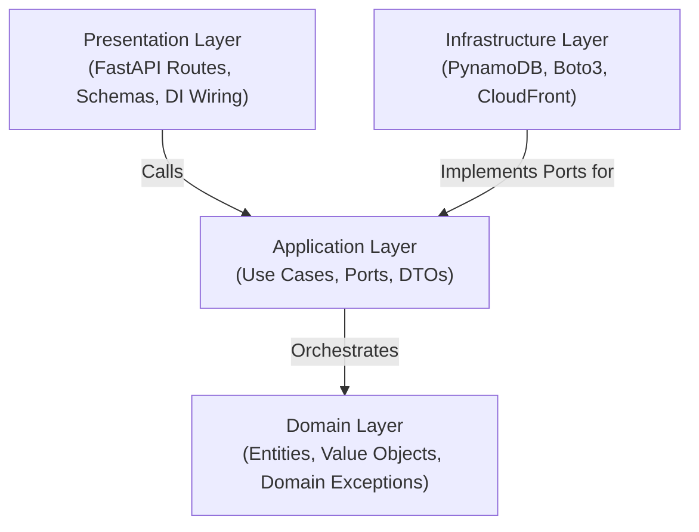

# DurianPy Badge System Backend

## Table of Contents
1. [Project Description](#1-project-description)
2. [Prerequisites](#2-prerequisites)
3. [Architecture Overview](#3-architecture-overview)
4. [Project Directory Structure](#4-project-directory-structure)
5. [Development Environment Setup (Dev Container)](#5-development-environment-setup-dev-container)
6. [AWS Authentication (AWS SSO)](#6-aws-authentication-aws-sso)
7. [Developer Workflows](#7-developer-workflows)
8. [Coding Conventions & Standards](#8-coding-conventions--standards)
9. [Testing & Code Coverage](#9-testing--code-coverage)
10. [Deployment & Runtime](#10-deployment--runtime)


## 1. Project Description

Durianpy Project - TBA


## 2. Prerequisites

To develop in this project, you need:

- **Docker Desktop** or **Docker Engine**: Required to run the containerized development environment.
- **Visual Studio Code** with the **Dev Containers** extension (or any IDE supporting the Development Container specification).
- **AWS CLI**: Installed on the host workstation to handle AWS IAM Identity Center (AWS SSO) authentication.


## 3. Architecture Overview

This project is built following Clean Architecture principles (Ports and Adapters / Hexagonal Architecture). The system enforces a strict inward dependency rule where core business logic remains independent of frameworks, databases, and external cloud infrastructure.



### Layer Responsibilities

- **Domain Layer (`src/domain/`)**: Contains pure enterprise domain entities, value objects, and domain exception hierarchies. Has zero external dependencies.
- **Application Layer (`src/application/`)**: Defines use case interactors, use case input/output ports (`UseCasePort`), data transfer objects (DTOs), and repository/storage port contracts.
- **Infrastructure Layer (`src/infrastructure/`)**: Implements outbound ports using concrete AWS services (PynamoDB for Amazon DynamoDB, Boto3 for AWS Systems Manager and Amazon CloudFront).
- **Presentation Layer (`src/presentation/`)**: Provides HTTP entry points via FastAPI routers, request/response Pydantic schemas, dependency injection providers, and global exception handlers.


## 4. Project Directory Structure

```
.
├── .devcontainer/                  # Dev Container definitions and IDE configuration
│   └── devcontainer.json           # VS Code / Dev Container specification
├── docker/                         # Dockerfiles for local container environment
│   └── local/
│       └── Dockerfile              # Python 3.12 base image with uv and tools
├── src/                            # Application source code
│   ├── application/                # Application layer
│   │   ├── dtos/                   # Data Transfer Objects
│   │   ├── ports/                  # Inbound and outbound abstract ports
│   │   │   ├── repositories/       # Database repository port interfaces
│   │   │   ├── storage/            # Object storage and CDN resolver ports
│   │   │   └── use_cases/          # Use case port contracts
│   │   └── use_cases/              # Use case interactor implementations
│   ├── core/                       # Cross-cutting concerns
│   │   ├── audit.py                # Audit attribution utilities
│   │   ├── logging.py              # Singleton Logger and sensitive data masking
│   │   └── settings.py             # Application settings configuration
│   ├── domain/                     # Domain layer
│   │   ├── exceptions/             # Domain exception hierarchy
│   │   └── models/                 # Domain entities and value objects
│   ├── infrastructure/             # Infrastructure layer
│   │   ├── db/                     # DynamoDB models and PynamoDB repositories
│   │   │   ├── models/             # PynamoDB database table models
│   │   │   └── pynamo_repositories/# Concrete repository port implementations
│   │   └── storage/                # Concrete storage and CDN resolver adapters
│   └── presentation/               # Presentation layer
│       └── api/                    # FastAPI web presentation
│           ├── dependencies/       # Dependency Injection providers
│           ├── routes/             # API route controllers
│           ├── schemas/            # Request and response Pydantic schemas
│           ├── exception_handlers.py# Global domain exception handlers
│           ├── main.py             # ASGI application entrypoint
│           └── mangum_handler.py   # AWS Lambda Mangum handler
├── tests/                          # Automated test suite
│   └── unit/                       # Unit tests partitioned by layer
│       ├── application/            # Use case and DTO tests
│       ├── core/                   # Settings, logging, and audit tests
│       ├── domain/                 # Domain model and exception tests
│       ├── infrastructure/         # DynamoDB repository and storage tests
│       └── presentation/           # Controller and exception handler tests
├── Justfile                        # Task runner command definitions
├── pyproject.toml                  # Project metadata, dependencies, and tool configs
└── uv.lock                         # Pinned dependency lockfile
```


## 5. Development Environment Setup (Dev Container)

Development for this project is standardized through **Dev Containers** to ensure consistent environments across all workstations.

### 5.1 Open in Dev Container

1. Open the project folder in Visual Studio Code.
2. When prompted by the Dev Containers extension, select **Reopen in Container** (or open the Command Palette with `Ctrl+Shift+P` / `Cmd+Shift+P` and choose `Dev Containers: Reopen in Container`).
3. The container will build using `docker/local/Dockerfile` and automatically execute `uv sync --frozen` and `just prepare-pre-commit` during initialization.
4. Host configuration directories (`~/.aws`, `~/.ssh`, `~/.gitconfig`) are automatically mounted into the container.

> [!IMPORTANT]
> **First and Foremost**: Before writing code or making commits, always ensure the git hooks are installed and initialized:
> ```bash
> just prepare-pre-commit
> ```
> This configures `pre-commit` (running `ruff` linting and formatting) and `commit-msg` (enforcing Conventional Commits) via `prek`.


## 6. AWS Authentication (AWS SSO)

Authenticate against AWS IAM Identity Center on your host machine or within the Dev Container:

```bash
aws sso login --profile <your-dev-profile>
export AWS_PROFILE=<your-dev-profile>
```

Application settings are managed through `pydantic-settings` and loaded directly from environment variables and the local `.env` file.


## 7. Developer Workflows

A `Justfile` is provided inside the Dev Container to streamline development tasks:

### 7.1 First and Foremost: Install Pre-commit Hooks (Mandatory)

> [!IMPORTANT]
> **Run this command first before contributing code or making commits!**
>
> ```bash
> just prepare-pre-commit
> ```
>
> This initializes and installs the `pre-commit` and `commit-msg` git hooks using `prek`. These hooks automatically validate code formatting (`ruff format`), check lint rules (`ruff check`), and enforce [Conventional Commits](#86-conventional-commits) prior to every git commit.

### 7.2 Run Local Development Server

Starts FastAPI with hot-reloading:

```bash
just run-local-api
```

The API will be accessible at `http://127.0.0.1:8000`. Interactive OpenAPI documentation is available at `http://127.0.0.1:8000/docs`. Port 8000 is forwarded from the Dev Container to the host.

### 7.3 Run Unit Tests

Execute the automated test suite with coverage enforcement ($\ge$ 95%):

```bash
just run-unit-test
```

Running this command automatically generates an interactive HTML coverage report stored in `htmlcov/index.html`.


### 7.4 Code Formatting and Linting

This project uses `ruff` for linting and code formatting:

```bash
# Format code
uv run ruff format .

# Check lint rules
uv run ruff check .

# Automatically apply safe lint fixes
uv run ruff check --fix .
```

### 7.5 Type Checking

Type checking is managed via `ty`:

```bash
uv run ty
```


## 8. Coding Conventions & Standards

### 8.1 Private Member Naming Convention
All private instance attributes, helper methods, and class-level constants must use double underscores (`__`):
- Private attributes: `self.__repository`, `self.__media_url_resolver`
- Private methods: `def __to_domain(self, record: Model) -> DomainModel:`
- Private constants: `__MEETUP_PK_PREFIX = 'MEETUP#'`

### 8.2 Execution Logging
- The `@log_execution` decorator must be applied exclusively to `execute()` methods of use case interactors in `src/application/use_cases/`.
- Do not apply `@log_execution` to repositories, adapters, route handlers, or health checks.

### 8.3 Event Logging and Sensitive Data Masking
- Log meaningful state changes (e.g., database writes, status mutations) using concise, action-oriented messages with resource identifiers.
- Always mask sensitive user attributes, tokens, credentials, or PII using `mask_string` from `src.core.logging`:
  ```python
  from src.core.logging import logger, mask_string

  logger.info(f"Created badge design '{design.design_id}' for user '{mask_string(user_id)}'")
  ```

### 8.4 Domain Exception Boundaries & Stack Trace Prevention
- Infrastructure adapters must catch vendor-specific exceptions (e.g., `PynamoDBException`, `ClientError`) and translate them to domain exceptions (`DomainError`, `RepositoryError`, `StorageServiceError`).
- Global exception handlers in `src/presentation/api/exception_handlers.py` sanitize all outgoing API errors into uniform JSON envelopes, preventing internal stack traces and database details from leaking to clients.

### 8.5 Docstrings (reST Format)
All public modules, classes, methods, and functions must be documented with PEP 257 compliant docstrings following the **reStructuredText (reST / Sphinx)** style:
- Specify parameter types and descriptions with `:param <name>:` and `:type <name>:`.
- Specify return values with `:returns:` and `:rtype:`.
- Specify domain exceptions with `:raises <ExceptionName>:`.

### 8.6 Conventional Commits
All Git commit messages must strictly adhere to the [Conventional Commits specification](https://www.conventionalcommits.org/en/v1.0.0/):
- **Format**: `<type>(<scope>): <description>`
- **Types**: `feat` (new features), `fix` (bug fixes), `refactor` (code refactoring), `test` (test suites), `docs` (documentation), `style` (formatting/linting), `chore` (maintenance/dependencies), `ci` (CI workflows).
- **Style**: Use concise, imperative lowercase descriptions without trailing periods. Commits are validated via `prek` pre-commit hooks.


## 9. Testing & Code Coverage

The test suite is built on `pytest` and `moto` (mocking AWS DynamoDB). Tests are categorized under `tests/unit/`:

- `tests/unit/application/`: Use case business logic, DTO mapping, and abstract port contract tests.
- `tests/unit/core/`: Settings, logging singleton, audit attribution, and execution decorator tests.
- `tests/unit/domain/`: Domain model invariants and exception structures.
- `tests/unit/infrastructure/`: DynamoDB repository transactions and CloudFront media resolver tests.
- `tests/unit/presentation/`: FastAPI routes, HTTP status codes, Swagger Basic Auth, Mangum Lambda adapter, and exception handlers via `TestClient`.

Run the automated test suite inside the Dev Container:

```bash
just run-unit-test
```

### Coverage Enforcement & HTML Report
- **Enforced Threshold**: The test suite enforces a strict minimum coverage threshold of **$\ge$ 95%** (configured via `fail_under = 95` in `pyproject.toml`). The project currently achieves **99.49%** test coverage across all layers.
- **HTML Coverage Report**: Every test run automatically generates a line-by-line interactive HTML coverage report stored in the **`htmlcov/`** directory:
  ```
  htmlcov/index.html
  ```


## 10. Deployment & Runtime

- **Serverless Runtime**: Designed for AWS Lambda using `Mangum` ASGI adapter (`src/presentation/api/mangum_handler.py`).
- **Cold Start Optimization**: Integrated with `lambda-warmer-py` to support provisioned concurrency keep-alive pings.
